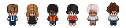

# PixelCrew 🤖🎮

**Veja seus agentes de IA trabalhando em tempo real — em Pixel Art retrô no seu VS Code!**

PixelCrew é uma extensão para o VS Code que cria um escritório virtual em 2D (visão top-down), onde pequenos avatares animados representam seus agentes de IA em tempo real. Sempre que um agente de IA executa tarefas (escreve código, lê arquivos, executa testes ou aguarda inputs), ele se desloca para uma mesa, interage com o computador e balões de fala mostram suas atividades.



---

## ✨ Funcionalidades Principais

- **Visualização em Tempo Real**: Veja seus agentes de IA trabalhando, lendo arquivos, digitando ou pensando enquanto agem em seu workspace.
- **Suporte a Múltiplos Provedores (Adapters)**:
  - **Claude Code**: Monitoramento automático através dos logs em tempo real do Claude CLI.
  - **Antigravity / Gemini**: Integração nativa com os logs do assistente Antigravity da Google.
  - **WebSocket Genérico**: Servidor WebSocket embutido (porta padrão `7891`) para que qualquer script externo ou agente customizado possa enviar atualizações de status.
- **Painel do Supervisor**:
  - **Customização de Squads**: Defina nomes personalizados para seus agentes diretamente sobre a cabeça deles.
  - **Troca de Avatares**: Altere as skins/paletas dos personagens para montar o seu time ideal.
  - **Exclusão Manual (❌)**: Delete agentes do escritório instantaneamente caso a tarefa tenha sido encerrada ou cancelada.
- **Ambientes (Mapas) Customizados**:
  - **Default Layout**: Um escritório moderno completo com 6 mesas e computadores frontais perfeitamente alinhados.
  - **Hacker Basement**: Um tema escuro estilo "porão hacker" com luz neon para squads noturnos.
- **Controles Interativos**:
  - **Zoom e Pan (Arrastar)**: Controle a visualização do canvas dando zoom com scroll do mouse e arrastando a tela.
  - **Internacionalização**: Suporte nativo para **Português (PT-BR)** e **Inglês (EN)**.
  - **Som Opcional**: Sons customizados ao concluir tarefas e ações.

---

## 🛠️ Requisitos de Instalação e Desenvolvimento

Antes de começar, certifique-se de ter instalado em sua máquina:
- **Node.js** (versão 18 ou superior)
- **NPM** (instalado com o Node.js)
- **VS Code**

---

## 🚀 Como Executar Localmente & Contribuir

Para rodar a extensão em ambiente de desenvolvimento, siga as instruções abaixo:

### 1. Clonar o Repositório
```bash
git clone https://github.com/pixelcrew-hq/pixelcrew.git
cd PixelCrew
```

### 2. Instalar as Dependências
Instale as dependências da extensão na raiz e também na pasta da Webview:

```bash
# Na raiz do projeto:
npm install

# Na pasta da Webview (UI):
cd webview-ui
npm install
cd ..
```

### 3. Compilar a Extensão
Compile o projeto (a Webview usando Vite e a Extensão usando esbuild):
```bash
# Em sistemas Windows (através do CMD ou PowerShell com Bypass):
cmd.exe /c "npm run build"

# Em sistemas macOS / Linux:
npm run build
```

### 4. Depurar no VS Code
1. Abra a pasta raiz do projeto no VS Code.
2. Pressione `F5` (ou vá em **Run and Debug** -> **Launch Extension**).
3. Uma nova janela do VS Code ("Extension Development Host") se abrirá.
4. Nessa nova janela, abra a paleta de comandos (`Ctrl+Shift+P` ou `Cmd+Shift+P`) e digite:
   **`PixelCrew: Abrir Escritório`**
5. O escritório virtual se abrirá!

---

## 📦 Como Gerar o Arquivo de Instalação (`.vsix`)

Se você quer apenas instalar a extensão no seu VS Code de uso diário sem precisar rodar em modo de desenvolvimento, você pode empacotar a extensão em um arquivo `.vsix`:

```bash
# Empacotar (gera o arquivo pixelcrew-X.Y.Z.vsix na raiz)
cmd.exe /c "npm run build && npm run package"  # Windows
# ou
npm run build && npm run package               # macOS/Linux
```

Para instalar o arquivo gerado no VS Code:
1. Abra a aba de **Extensões** no VS Code (`Ctrl+Shift+X` ou `Cmd+Shift+X`).
2. Clique no menu de três pontos (`...`) no canto superior direito do painel de extensões.
3. Escolha **Install from VSIX...** (Instalar a partir de VSIX...).
4. Selecione o arquivo `.vsix` gerado na raiz do projeto.
5. Pressione `Ctrl+Shift+P` (ou `Cmd+Shift+P`) e execute o comando: **`Developer: Reload Window`**.

---

## ⚙️ Configurações da Extensão (`Settings`)

Você pode personalizar as configurações do PixelCrew indo em **Settings** (`Ctrl+,`) e buscando por **PixelCrew**:

- `pixelcrew.defaultProvider`: Define o adapter padrão ao adicionar novos agentes manualmente (`claude-code`, `antigravity`, `generic`).
- `pixelcrew.antigravityLogsPath`: Caminho absoluto para a pasta de logs do Antigravity (Caso deixe em branco, ele tentará detectar automaticamente na sua pasta de usuário `~/.gemini/antigravity-ide/brain`).
- `pixelcrew.claudeLogsPath`: Caminho absoluto para a pasta de logs do Claude Code (Caso deixe em branco, ele tentará detectar na pasta padrão `~/.claude/projects`).
- `pixelcrew.websocketPort`: A porta de escuta do servidor WebSocket genérico (Padrão: `7891`).
- `pixelcrew.theme`: Seleciona o mapa padrão (`default-layout-1` ou `hacker-basement`).

---

## 🔌 Integrando seus Próprios Agentes (Generic WebSocket)

Qualquer script Python, Bash, Node.js ou agente inteligente que você mesmo construir pode interagir com o escritório virtual enviando mensagens JSON simples via WebSocket para o servidor na porta configurada (`ws://localhost:7891`).

### Exemplo de Mensagem JSON a enviar:

```json
{
  "agentId": "meu-agente-python",
  "status": "typing",
  "detail": "Gerando testes unitários...",
  "tool": "pytest"
}
```

#### Status Suportados:
- `"idle"`: O agente fica parado em pé, descansando.
- `"thinking"`: O agente fica na mesa pensando (animação leve).
- `"reading"`: O agente lê arquivos.
- `"typing"`: O agente digita rapidamente no computador.
- `"waiting"`: O agente fica parado aguardando input do usuário.

---

## 🤝 Contribua com a Comunidade!

PixelCrew é um projeto **Open Source** feito para a comunidade! Adoraríamos receber suas ideias e melhorias. Você pode contribuir das seguintes formas:
- **Novos Avatares & Sprites**: Adicione novos designs de personagens pixel art em `webview-ui/public/game_assets/characters/`.
- **Novos Mapas**: Crie arquivos de layout JSON adicionais em `webview-ui/public/` e configure novas decorações.
- **Novos Provedores/Adapters**: Escreva novos adapters para outras LLMs locais ou ferramentas de IA na pasta `src/adapters/`.
- **Efeitos de Som**: Adicione novos efeitos sonoros e feedbacks divertidos na UI.

Sinta-se à vontade para abrir **Issues** e enviar **Pull Requests**! 🚀

---

## 📄 Licença

Este projeto é licenciado sob a licença [MIT](LICENSE).
